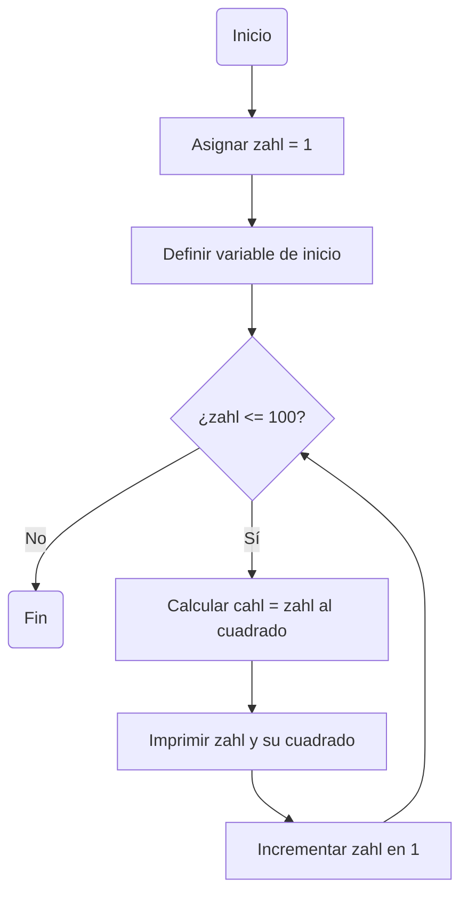

# Reto_6
Desarrolle de manera individual la mayoría de ejercicios en clase. Para cada punto cree un programa individual asimismo cree un notebook con la solución a todos los problemas. Al finalizar suba todo a un repo y subalo al canal reto_6 en slack, los tres primeros puntos deben incluir diagrama de flujo.

Nota: Todo el código de aquí en adelante debe ir debidamente documentado.

1. Imprimir un listado con los números del 1 al 100 cada uno con su respectivo cuadrado

3. Imprimir un listado con los números impares desde 1 hasta 999 y seguidamente otro listado con los números pares desde 2 hasta 1000.
4. Imprimir los números pares en forma descendente hasta 2 que son menores o iguales a un número natural n ≥ 2 dado
5. Imprimir el factorial de un número natural n dado.
6. Implementar un programa que ingrese un número de 2 a 50 y muestre sus divisores.
7. Implementar el algoritmo que muestre los números primos del 1 al 100. Nota: use funciones
