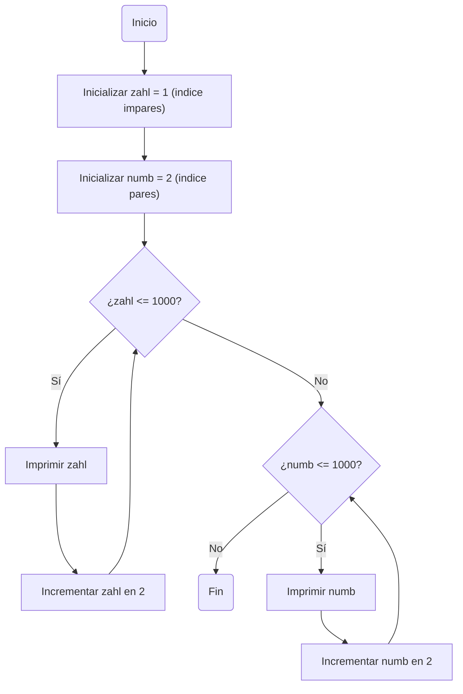

# Reto_6
Desarrolle de manera individual la mayoría de ejercicios en clase. Para cada punto cree un programa individual asimismo cree un notebook con la solución a todos los problemas. Al finalizar suba todo a un repo y subalo al canal reto_6 en slack, los tres primeros puntos deben incluir diagrama de flujo.

Nota: Todo el código de aquí en adelante debe ir debidamente documentado.

1. Imprimir un listado con los números del 1 al 100 cada uno con su respectivo cuadrado

```python
if __name__=="__main__":
    zahl = 1 #Variable de inicio en 1
    while zahl <= 100: #el ciclo ira hasta 100
        cahl = zahl ** 2 #cuadrado del numero
        print(zahl, ": ", zahl, "^2=", cahl)
        zahl += 1 #asignacion incremento
```
2. Imprimir un listado con los números impares desde 1 hasta 999 y seguidamente otro listado con los números pares desde 2 hasta 1000.

```python
if __name__=="__main__":
    zahl : int = 1 #variable para inicializar impares
    numb : int = 2 #variable para inicializar pares
    
    while zahl <= 1000:
        print(zahl)
        zahl += 2#incremento en impares
    print()
    while numb <= 1000:
        print(numb)
        numb += 2#incremento en pares
```
3. Imprimir los números pares en forma descendente hasta 2 que son menores o iguales a un número natural n ≥ 2 dado

```python
if __name__=="__main__":

    zahl = int(input("Ingrese el numero con el que desea iniciar: "))

    while zahl >= 2:
        if zahl%2 != 0: # se revisa que sea par
            zahl = zahl-1 # se vuelve par si es necesario
        print(zahl)
        zahl -= 1 # asignacion de decremento
```
7. Imprimir el factorial de un número natural n dado.
8. Implementar un programa que ingrese un número de 2 a 50 y muestre sus divisores.
9. Implementar el algoritmo que muestre los números primos del 1 al 100. Nota: use funciones
